# ØRACLE Telegram Bot — Technical Planning Document

> **Status:** Draft / Proposed
> **Owner:** Oracle Engineering
> **Last updated:** 2026-06-15
> **Related:** `backend/src/services/ai.service.ts`, `backend/src/utils/tx-builder.ts`, `backend/prisma/schema.prisma`

---

## Table of contents

1. [Feature overview](#1-feature-overview)
2. [Problem statement](#2-problem-statement)
3. [Goals and non-goals](#3-goals-and-non-goals)
4. [Complete user flow](#4-complete-user-flow)
5. [Telegram account linking flow](#5-telegram-account-linking-flow)
6. [Wallet-to-user mapping flow](#6-wallet-to-user-mapping-flow)
7. [Telegram bot conversation flow](#7-telegram-bot-conversation-flow)
8. [Supported actions and commands](#8-supported-actions-and-commands)
9. [Architecture design](#9-architecture-design)
10. [Backend services required](#10-backend-services-required)
11. [API endpoints required](#11-api-endpoints-required)
12. [Database schema changes](#12-database-schema-changes)
13. [Security and authentication model](#13-security-and-authentication-model)
14. [Permission and approval flow for sensitive actions](#14-permission-and-approval-flow-for-sensitive-actions)
15. [Transaction signing and confirmation flow](#15-transaction-signing-and-confirmation-flow)
16. [Alert and notification system](#16-alert-and-notification-system)
17. [Error handling cases](#17-error-handling-cases)
18. [Rate limiting and abuse prevention](#18-rate-limiting-and-abuse-prevention)
19. [Logging, monitoring, and audit trail](#19-logging-monitoring-and-audit-trail)
20. [Implementation phases](#20-implementation-phases)
21. [Testing plan](#21-testing-plan)
22. [Future improvements](#22-future-improvements)

---

## 1. Feature overview

ØRACLE today is a web app: a user connects a wallet via Reown/WalletConnect, and an AI (Claude) answers questions grounded in live on-chain data fetched through Moralis/CoinGecko. Read operations are non-custodial and stateless; write operations (send ETH / send ERC-20) are returned by the AI as a structured `txIntent` and **signed entirely client-side** in the browser — the backend never holds keys.

This feature extends Oracle into a **Telegram bot** that acts as a crypto AI assistant in chat. After linking a Telegram account to an Oracle wallet, a user can:

- View wallet balances and net worth
- Send crypto (native + ERC-20)
- Swap tokens
- View recent transactions
- Track portfolio performance over time
- Get crypto market updates (Fear & Greed, news, macro)
- Ask questions grounded in their own wallet activity
- Ask general crypto / DeFi / trading / paper-trading / news questions
- Receive proactive alerts (transactions, price moves, portfolio changes, news)

The central design constraint is that **Oracle must remain non-custodial**. Telegram has no embedded Web3 wallet and the bot must never receive a private key. Therefore every state-changing action initiated in Telegram is **prepared** by the backend but **signed via a secure handoff** back to the user's connected wallet (web app / WalletConnect deep link). This document specifies that handoff in detail.

---

## 2. Problem statement

Oracle's value — "ask anything about your wallet in plain English" — is currently locked behind a desktop-first browser app. Crypto users live in Telegram: it is where alpha, communities, trading groups, and project announcements already happen. Asking a user to context-switch into a browser tab to check a balance or react to a price move adds friction at exactly the moment that matters.

Concretely:

- **No ambient access.** Users can't glance at their portfolio without opening the app and reconnecting a wallet.
- **No proactive signal.** Oracle knows a wallet's risk profile and the market context but has no channel to *push* a timely alert ("ETH dropped 8%, your portfolio is down $1,240, concentration risk is now HIGH").
- **High-friction actions.** Even simple sends require the full web flow.
- **Wallet-based identity is ephemeral.** There is no persistent user record (only `WalletSnapshot` keyed by address), so there's nothing to attach a Telegram identity, preferences, or alert subscriptions to.

The bot solves ambient access and proactive signal while preserving Oracle's non-custodial guarantee.

---

## 3. Goals and non-goals

### Goals

- **G1** — Let a user securely link a Telegram account to an Oracle wallet from the Settings page.
- **G2** — Provide conversational + command-based access to balances, transactions, portfolio, and market data inside Telegram.
- **G3** — Allow value-transfer actions (send, swap) to be *initiated* in Telegram and *signed* non-custodially via a secure handoff.
- **G4** — Deliver a configurable, opt-in alerting system (transactions, price, portfolio, news).
- **G5** — Reuse existing backend services (`wallet.service`, `market.service`, `ai.service`, `tx-builder`) rather than forking logic.
- **G6** — Preserve Oracle's security posture: no private keys, explicit confirmation for every transaction, full audit trail.

### Non-goals

- **NG1** — Custodial signing or a bot-managed hot wallet. Out of scope, permanently.
- **NG2** — Storing seed phrases or private keys anywhere, ever.
- **NG3** — Executing trades/swaps fully inside Telegram without the user's wallet signing. (Signing always returns to the wallet.)
- **NG4** — Multi-user / group-chat trading. The bot operates in 1:1 DMs only for v1.
- **NG5** — Supporting non-EVM chains in v1 (Oracle is EVM-only today).
- **NG6** — Replacing the web app. Telegram is an additional surface, not a replacement.

---

## 4. Complete user flow

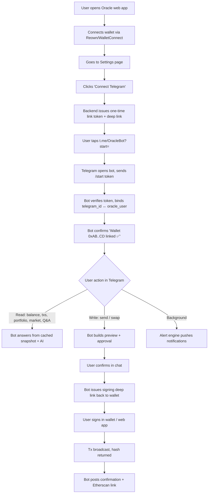

### Narrative

1. **Onboard on web.** Wallet connection and identity continue to originate in the web app where WalletConnect lives.
2. **Link Telegram** from Settings (Section 5).
3. **Use the bot** for reads and Q&A immediately (no signing needed).
4. **Initiate writes** in chat; the bot prepares an unsigned transaction and hands signing back to the wallet (Section 15).
5. **Receive alerts** based on subscriptions configured in Settings or via `/alerts` in the bot.

---

## 5. Telegram account linking flow

Linking is the security-critical bootstrap. The web session (which has proven wallet ownership via a signed SIWE message — see Section 13) is the **source of trust**. We mint a short-lived, single-use **link token**, encode it in a Telegram deep link, and let Telegram's `/start` payload deliver the user's `telegram_id` back to us. We then bind the two.

### 5.1 Linking sequence diagram

```mermaid
sequenceDiagram
    autonumber
    participant U as User (browser)
    participant FE as Oracle Web (Settings)
    participant BE as Oracle Backend
    participant DB as Postgres
    participant TG as Telegram
    participant BOT as Oracle Bot

    U->>FE: Open Settings → "Connect Telegram"
    FE->>BE: POST /api/telegram/link/init  (session: SIWE-authed)
    BE->>DB: insert TelegramLinkToken {token, oracleUserId, expiresAt=10m, used=false}
    BE-->>FE: { deepLink: "https://t.me/OracleBot?start=<token>", token }
    FE->>U: Show "Open Telegram" button + QR code
    U->>TG: Tap deep link
    TG->>BOT: /start <token>
    BOT->>BE: POST /api/telegram/link/confirm { token, telegramId, tgUsername }
    BE->>DB: validate token (exists, !used, !expired)
    alt valid
        BE->>DB: set used=true; upsert TelegramAccount {telegramId ↔ oracleUserId}
        BE-->>BOT: { ok, walletAddress }
        BOT->>U: "✅ Linked to 0xAB..CD. Type /help to begin."
        BE-->>FE: (poll/SSE) status=linked → UI shows "Connected as @user"
    else invalid/expired/used
        BE-->>BOT: { ok:false, reason }
        BOT->>U: "⚠️ This link expired. Generate a new one from Settings."
    end
```

### 5.2 Link token rules

| Property | Value |
|---|---|
| Length / entropy | 32 bytes, base64url (≥ 256 bits) |
| TTL | 10 minutes |
| Single use | `used=true` set atomically on confirm |
| Scope | Bound to exactly one `oracleUserId` at mint time |
| Rate limit | Max 5 active tokens per user; new init invalidates older unused tokens |
| Re-link | A `telegram_id` can be bound to only one Oracle user at a time; re-link requires unlink first |

### 5.3 Settings page UI states

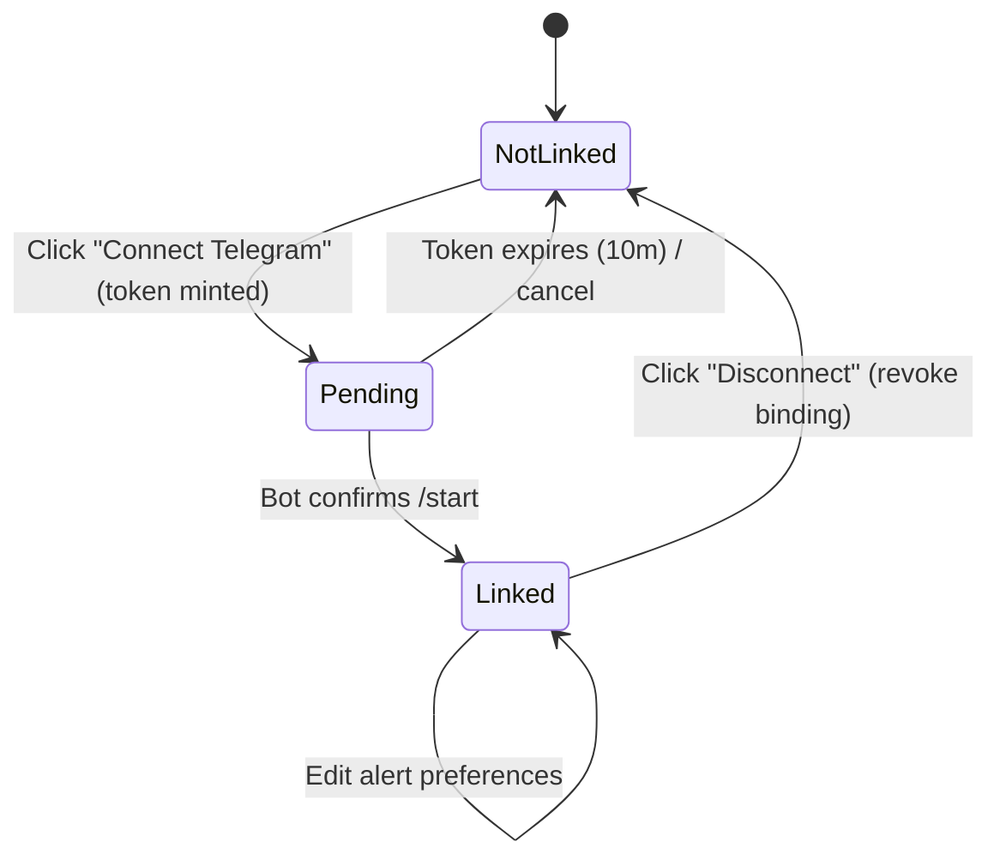

- **NotLinked** — "Connect Telegram" button.
- **Pending** — Show deep link button + QR + countdown; poll `GET /api/telegram/link/status`.
- **Linked** — Show `@username`, linked-at timestamp, alert toggles, "Disconnect" button.

### 5.4 Unlinking

Unlink from either side: Settings "Disconnect", or `/unlink` in the bot (which requires a confirmation tap). Unlink deletes the `TelegramAccount` binding, cancels pending alert subscriptions, and revokes any outstanding signing-handoff tokens.

---

## 6. Wallet-to-user mapping flow

Today Oracle has no `User` concept — `WalletSnapshot` is keyed directly by address and there is no auth. To attach a Telegram identity, preferences, and alert subscriptions, we introduce a first-class **`User`** entity. A user can own one or more wallet addresses; a Telegram account binds to a user (not directly to an address), so the user can switch the "active" wallet without re-linking Telegram.

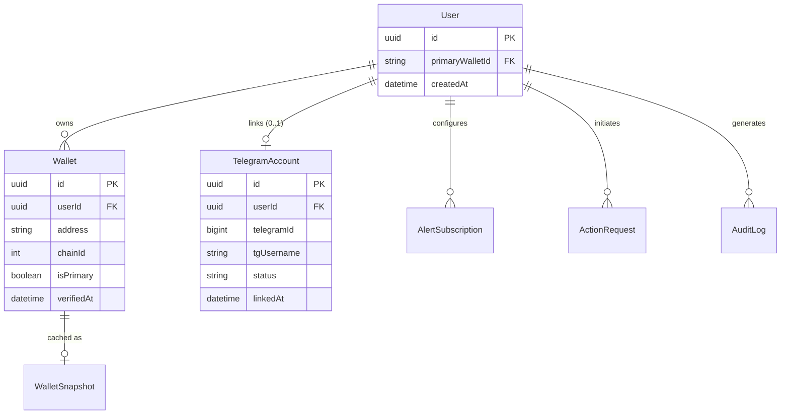

### 6.1 Mapping rules

- A **Wallet** is verified by a SIWE (Sign-In With Ethereum) signature proving the user controls the private key. Verification creates/locates a `User` and attaches the `Wallet`.
- A user designates one **active/primary** wallet; the bot operates against it unless the user switches via `/wallet`.
- A **TelegramAccount** maps `telegram_id → userId`. Every inbound Telegram update resolves to a user via this mapping; unmapped chats only get `/start` and `/help`.

### 6.2 Resolution on every Telegram message

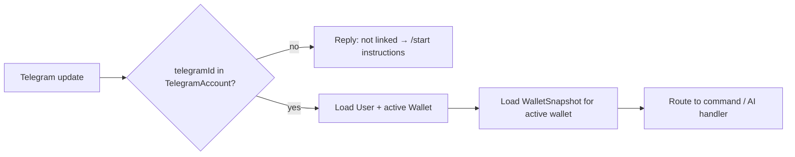

---

## 7. Telegram bot conversation flow

The bot supports two interaction styles that share one backend brain:

1. **Slash commands** — deterministic, fast, no LLM call (e.g. `/balance`).
2. **Natural language** — routed through the existing `ai.service` Claude tool-calling pipeline, which already emits `txIntent`-style structured outputs.

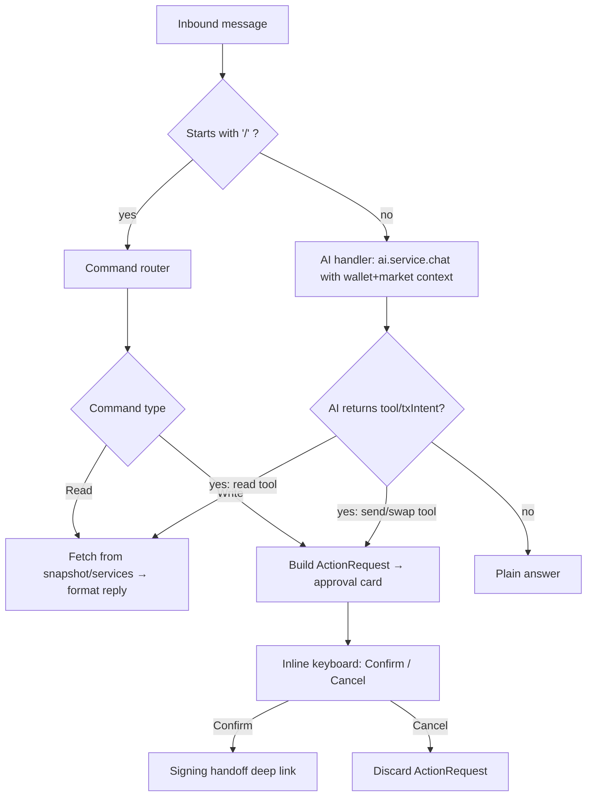

### 7.1 Conversation state

The bot is mostly stateless per message, but multi-step actions (send/swap) need short-lived state. We keep a **conversation/session context** keyed by `telegram_id`:

- Last N messages (for AI context continuity, capped, TTL 30 min).
- Pending `ActionRequest` id (the in-flight send/swap awaiting confirmation).
- Selected active wallet.

State is stored in Redis (preferred) or a `ConversationState` table; it is **never** a place for secrets.

### 7.2 Grounding context passed to the AI

For natural-language messages we reuse `getWalletForRead(address)` + `fetchMarketContext(wallet)` and pass the same wallet/market context the web `/api/chat` route already builds, so answers are identical in quality across surfaces. The only delta is the **action sink**: instead of returning a `txIntent` to a browser, the Telegram handler converts it into an `ActionRequest` + approval card.

---

## 8. Supported actions and commands

| Command | Type | Description | Signing? |
|---|---|---|---|
| `/start <token>` | System | Link account / greet | No |
| `/help` | System | List commands | No |
| `/link` | System | Re-issue link instructions | No |
| `/unlink` | System | Unbind Telegram from user | No |
| `/wallet` | Read | Show active wallet; switch among owned wallets | No |
| `/balance` | Read | Net worth + native + top tokens | No |
| `/portfolio` | Read | Allocation, risk level, concentration, stablecoin % | No |
| `/performance [24h\|7d\|30d]` | Read | Portfolio value change over window | No |
| `/transactions [n]` | Read | Recent decoded transactions (paged) | No |
| `/tx <hash>` | Read | Explain a specific transaction in plain English | No |
| `/market` | Read | Fear & Greed, macro, news relevant to holdings | No |
| `/send <amount> <token> to <addr/ENS>` | **Write** | Prepare transfer → approval → signing handoff | **Yes** |
| `/swap <amountA> <tokenA> for <tokenB>` | **Write** | Prepare swap quote → approval → signing handoff | **Yes** |
| `/alerts` | Config | View/toggle alert subscriptions | No |
| `/cancel` | System | Cancel a pending action | No |
| _free text_ | NL → AI | Anything: Q&A, market, "send 0.1 ETH to vitalik.eth" | Maybe |

Natural language maps onto the same set: e.g. "what's my eth worth?" → `/balance` logic; "swap 100 USDC for ETH" → swap flow. The AI tool schema already includes `send_eth` and `send_token`; we add a `swap` tool (Section 10) and read-only tools the AI can call to fetch fresh data.

---

## 9. Architecture design

### 9.1 High-level system architecture

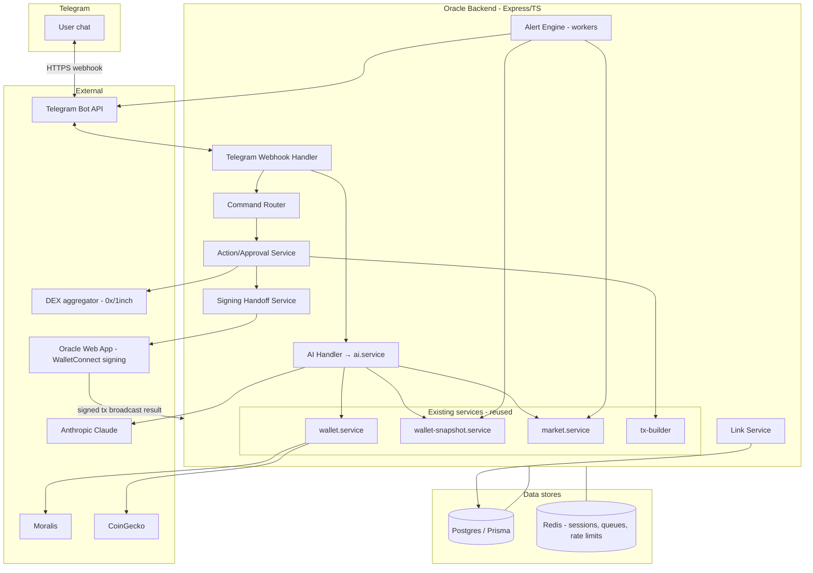

### 9.2 Key architectural decisions

- **Webhook over long-polling.** Use Telegram webhooks (`setWebhook`) terminating at `POST /api/telegram/webhook` with a secret path + `X-Telegram-Bot-Api-Secret-Token` header. Cheaper and lower-latency than polling on Railway.
- **Reuse the brain.** All wallet/market/AI logic stays in existing services. The bot is an additional *transport adapter*, not a second implementation.
- **Non-custodial signing via handoff.** Writes never sign on the server. The Action service builds unsigned tx params with `tx-builder`; the Signing Handoff service produces a one-time deep link to the web app where the user's WalletConnect session signs (Section 15).
- **Async alert workers.** A separate worker process (BullMQ on Redis) evaluates alert rules on a schedule and on snapshot-refresh events, decoupled from request handling.
- **Stateless requests + Redis session.** Each webhook call is independent; transient conversation/action state lives in Redis with TTLs.

---

## 10. Backend services required

New services (all in `backend/src/services/telegram/` unless noted):

| Service | Responsibility |
|---|---|
| `telegram-bot.service.ts` | Wraps Telegram Bot API (send message, inline keyboards, edit message, answer callback). Single client used everywhere. |
| `telegram-webhook.service.ts` | Validates secret token, parses updates, dispatches to command router or AI handler, dedupes by `update_id`. |
| `command-router.service.ts` | Maps `/commands` → handlers; formats replies with MarkdownV2. |
| `link.service.ts` | Mint/validate link tokens, bind/unbind `TelegramAccount`, status polling. |
| `action.service.ts` | Create `ActionRequest` for send/swap, build approval cards, manage Confirm/Cancel lifecycle and TTL. |
| `signing-handoff.service.ts` | Mint one-time signing tokens, build deep links to web signer, receive broadcast callbacks. |
| `swap.service.ts` | Get quotes from a DEX aggregator (0x/1inch), build unsigned swap tx (router approval + swap calldata). |
| `alert.service.ts` | CRUD alert subscriptions; rule evaluation. |
| `alert-worker.ts` (worker process) | Scheduled + event-driven alert evaluation and dispatch via BullMQ. |
| `auth.service.ts` (shared) | SIWE nonce/verify, web session issuance — needed to give the web app a real authenticated session (Section 13). |

Reused unchanged: `wallet.service`, `wallet-snapshot.service`, `market.service`, `ai.service` (extended with a `swap` tool + read tools), `tx-builder`.

### 10.1 AI service extension

Add tool definitions in `backend/src/prompts/tools.ts`:

- `swap_tokens` — `{ fromToken, toToken, amount, chainId, slippageBps?, reason }`.
- Optional read tools so the AI can pull fresh data mid-conversation: `get_balance`, `get_transactions`, `get_market`.

The handler maps `send_eth` / `send_token` / `swap_tokens` tool calls to `ActionRequest`s instead of browser `txIntent`s. Read tools resolve against existing services.

---

## 11. API endpoints required

### Telegram + linking

| Method | Path | Auth | Purpose |
|---|---|---|---|
| `POST` | `/api/telegram/webhook/:secret` | Telegram secret token | Receive bot updates |
| `POST` | `/api/telegram/link/init` | Web session (SIWE) | Mint link token + deep link |
| `GET` | `/api/telegram/link/status` | Web session | Poll link state for Settings UI |
| `POST` | `/api/telegram/link/confirm` | Internal (from webhook) | Validate token, bind account |
| `POST` | `/api/telegram/unlink` | Web session or bot | Remove binding |

### Auth (new, prerequisite)

| Method | Path | Purpose |
|---|---|---|
| `GET` | `/api/auth/nonce` | Issue SIWE nonce |
| `POST` | `/api/auth/verify` | Verify SIWE signature → session (cookie/JWT), create/find `User` + `Wallet` |
| `POST` | `/api/auth/logout` | End session |

### Actions + signing

| Method | Path | Auth | Purpose |
|---|---|---|---|
| `POST` | `/api/actions/:id/confirm` | Internal (callback) | Mark approval, mint signing token |
| `GET` | `/api/actions/:id` | Web session (signer page) | Fetch unsigned tx params for signing |
| `POST` | `/api/actions/:id/result` | Web session + signing token | Submit broadcast result (hash/error) |
| `POST` | `/api/swap/quote` | Web session / internal | Get DEX quote (also used by web app) |

### Alerts

| Method | Path | Purpose |
|---|---|---|
| `GET` | `/api/alerts` | List subscriptions for user |
| `PUT` | `/api/alerts` | Update toggles/thresholds |

Existing endpoints (`/api/wallet/:address`, `/api/chat`, `/api/market/:address`, transactions) are reused by the bot internally — the bot calls the services directly rather than over HTTP.

---

## 12. Database schema changes

Current `schema.prisma` has only `WalletSnapshot`. We add user/identity, linking, actions, alerts, and audit models. `WalletSnapshot` gains a relation to `Wallet` (kept keyed by address for backward compatibility).

```prisma
model User {
  id              String        @id @default(uuid())
  wallets         Wallet[]
  telegram        TelegramAccount?
  alertSubs       AlertSubscription[]
  actionRequests  ActionRequest[]
  primaryWalletId String?
  createdAt       DateTime      @default(now())
  updatedAt       DateTime      @updatedAt
}

model Wallet {
  id         String   @id @default(uuid())
  userId     String
  user       User     @relation(fields: [userId], references: [id], onDelete: Cascade)
  address    String   // lowercase 0x...
  chainId    Int      @default(1)
  isPrimary  Boolean  @default(false)
  verifiedAt DateTime?
  createdAt  DateTime @default(now())

  @@unique([userId, address])
  @@index([address])
}

model TelegramAccount {
  id         String   @id @default(uuid())
  userId     String   @unique
  user       User     @relation(fields: [userId], references: [id], onDelete: Cascade)
  telegramId BigInt   @unique
  tgUsername String?
  status     String   @default("linked") // linked | revoked
  linkedAt   DateTime @default(now())
}

model TelegramLinkToken {
  id        String   @id @default(uuid())
  token     String   @unique
  userId    String
  used      Boolean  @default(false)
  expiresAt DateTime
  createdAt DateTime @default(now())

  @@index([userId])
}

model ActionRequest {
  id           String   @id @default(uuid())
  userId       String
  user         User     @relation(fields: [userId], references: [id], onDelete: Cascade)
  walletAddr   String
  kind         String   // SEND_ETH | SEND_TOKEN | SWAP
  status       String   @default("pending") // pending | approved | signing | broadcast | confirmed | failed | cancelled | expired
  payload      Json     // unsigned tx params from tx-builder / swap quote
  preview      Json     // human-readable summary shown in chat
  chainId      Int
  txHash       String?
  errorReason  String?
  signingToken String?  @unique
  expiresAt    DateTime
  createdAt    DateTime @default(now())
  updatedAt    DateTime @updatedAt

  @@index([userId, status])
}

model AlertSubscription {
  id        String   @id @default(uuid())
  userId    String
  user      User     @relation(fields: [userId], references: [id], onDelete: Cascade)
  type      String   // TX | PRICE | PORTFOLIO | NEWS
  enabled   Boolean  @default(true)
  config    Json     // thresholds, tokens, cadence
  createdAt DateTime @default(now())

  @@unique([userId, type])
}

model AuditLog {
  id        String   @id @default(uuid())
  userId    String?
  actor     String   // "telegram" | "web" | "system"
  event     String   // LINK | UNLINK | ACTION_CREATE | ACTION_CONFIRM | TX_BROADCAST | ALERT_SENT | RATE_LIMIT ...
  meta      Json
  createdAt DateTime @default(now())

  @@index([userId, createdAt])
}

model WalletSnapshot {
  address   String   @id
  payload   Json
  updatedAt DateTime @updatedAt
  walletId  String?  // optional link to Wallet
}
```

Migration is additive; existing `WalletSnapshot` rows are untouched. Backfill: on first SIWE login, create `User` + `Wallet` and link any existing snapshot by address.

---

## 13. Security and authentication model

### 13.1 Identity & trust chain

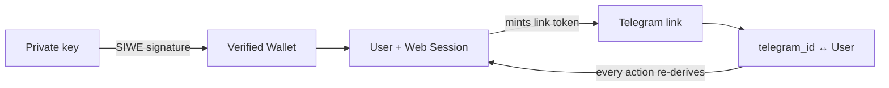

- **Wallet ownership** is proven once via **SIWE** (EIP-4361): backend issues a nonce, the wallet signs, backend verifies and creates a session. This replaces today's "no auth" model and is the prerequisite for trusting *any* Telegram binding.
- **Telegram binding** is bootstrapped from an authenticated web session only — a Telegram user can never self-assert ownership of a wallet.
- **No keys server-side.** The backend stores addresses, never keys. All signing is client-side via WalletConnect (unchanged from today).

### 13.2 Threat model & mitigations

| Threat | Mitigation |
|---|---|
| Attacker guesses/replays link token | 256-bit entropy, 10-min TTL, single-use, bound to one user |
| Attacker spoofs webhook | Secret URL path + `X-Telegram-Bot-Api-Secret-Token` verification; reject mismatches |
| Hijacked Telegram account sends `/send` | Every write requires fresh wallet signature; bot cannot move funds alone |
| Signing deep link intercepted | Signing token single-use, short TTL, bound to one `ActionRequest`; tx params displayed for user verification before signing |
| Telegram ID spoofing | Telegram API guarantees authentic `from.id`; we trust only updates received over the verified webhook |
| Replay of broadcast result | `signing token` consumed on first `/result`; idempotent by `ActionRequest` id |
| User links wrong wallet | Confirmation message shows masked address; user must verify |
| Bot token leak | Stored in secret manager; rotate via BotFather; webhook secret rotated alongside |
| Phishing via fake bot | Publish official handle in app + docs; bot replies include verifiable signing domain |

### 13.3 Secrets

`TELEGRAM_BOT_TOKEN`, `TELEGRAM_WEBHOOK_SECRET`, `DEX_AGGREGATOR_API_KEY`, plus existing `ANTHROPIC_API_KEY`, `MORALIS_API_KEY`. All via env/secret manager, never in repo.

---

## 14. Permission and approval flow for sensitive actions

Sensitive = anything that moves value (send, swap, token approval). Each requires an explicit two-step **prepare → approve → sign** ceremony. The bot can *prepare* and *display*, but value only moves after a wallet signature.

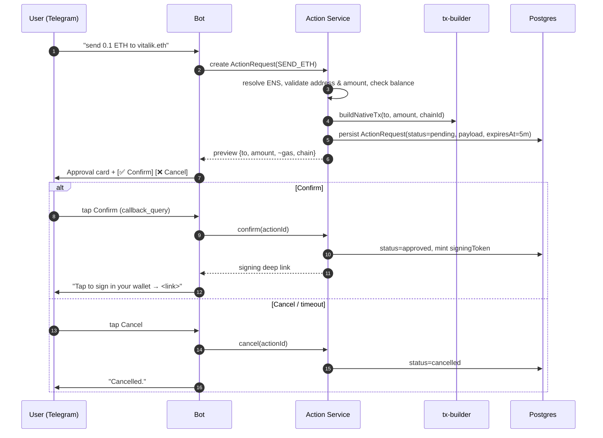

### 14.1 Approval card content (must show before any sign)

- Action type (Send / Swap), exact amount + token, USD estimate.
- Recipient (full address + ENS if resolved) or swap route (`100 USDC → ~0.039 ETH`, min received after slippage).
- Chain + estimated gas fee.
- Expiry countdown (5 min).
- Explicit buttons; no "auto-confirm".

### 14.2 Guards before approval is even offered

- Amount ≤ available balance (from latest snapshot; refresh if stale).
- Valid checksum address / resolvable ENS.
- Per-action and daily value limits (configurable; conservative defaults, e.g. warn above a threshold).
- Rate limit on pending actions (max 3 concurrent pending per user).

---

## 15. Transaction signing and confirmation flow

This is the crux of staying non-custodial. The bot prepares an unsigned transaction; the user signs it with the **same wallet** already connected to Oracle, via a **signing handoff** to the web app (which holds the live WalletConnect session). The result is reported back to the bot.

```mermaid
sequenceDiagram
    autonumber
    participant U as User
    participant BOT as Bot
    participant BE as Backend
    participant WEB as Oracle Web Signer
    participant WC as Wallet (WalletConnect)
    participant CHAIN as EVM RPC

    Note over U,BOT: Action already approved (Section 14)
    BE->>BE: mint signingToken (single-use, 5m TTL) → ActionRequest
    BOT->>U: "Sign securely: app.oracle../sign?aid=<id>&t=<signingToken>"
    U->>WEB: open link (browser w/ wallet session)
    WEB->>BE: GET /api/actions/:id (validate token) → unsigned tx params
    WEB->>U: Render confirmation (amount, to, gas) — second visual check
    U->>WEB: Click "Sign"
    WEB->>WC: wagmi sendTransaction(params)
    WC->>U: Wallet prompts to sign
    U->>WC: Approve
    WC->>CHAIN: broadcast
    CHAIN-->>WC: txHash
    WC-->>WEB: txHash
    WEB->>BE: POST /api/actions/:id/result { txHash } (consumes signingToken)
    BE->>BE: ActionRequest status=broadcast; subscribe to receipt
    BE->>BOT: push "📤 Sent. Tracking 0xhash…"
    CHAIN-->>BE: receipt (confirmed/failed)
    BE->>BOT: "✅ Confirmed: <etherscan link>" / "❌ Reverted"
    BOT->>U: final status
```

### 15.1 Why a handoff (not in-Telegram signing)

- Telegram has no Web3 provider; injecting one would mean custodial keys — a hard non-goal.
- The web app already integrates Reown/Wagmi and the exact `tx-builder` output format used in the current send flow, so the signer page is a thin reuse of `SendConfirmModal` logic.
- Swap signing may require **two** transactions (ERC-20 `approve` then swap); the signer page sequences them and reports each leg.

### 15.2 Alternative for advanced users (future)

A WalletConnect-from-Telegram approach (the backend pushes a session request the wallet app receives directly) is possible if the user's wallet supports it, removing the browser hop. Deferred to Future improvements; the web handoff is the v1 baseline because it works for every wallet Oracle already supports.

### 15.3 Confirmation tracking

After broadcast, `ActionRequest` enters `broadcast`; a receipt watcher (poll RPC / Moralis) transitions it to `confirmed` or `failed` and the bot edits/sends the final message. Snapshot for the wallet is invalidated/refreshed so subsequent reads reflect the new balance.

---

## 16. Alert and notification system

Opt-in, per-type subscriptions stored in `AlertSubscription`. A worker process evaluates rules and pushes via the Telegram Bot API.

### 16.1 Alert types

| Type | Trigger | Source |
|---|---|---|
| **TX** | New inbound/outbound tx detected on a watched wallet | Snapshot diff / Moralis stream |
| **PRICE** | Token in holdings moves > threshold % in window | CoinGecko |
| **PORTFOLIO** | Net worth changes > threshold, or risk level changes (e.g. → HIGH) | Snapshot diff + risk calc |
| **NEWS** | High-relevance news for held assets | `market.service` news/sentiment |

### 16.2 Notification flow

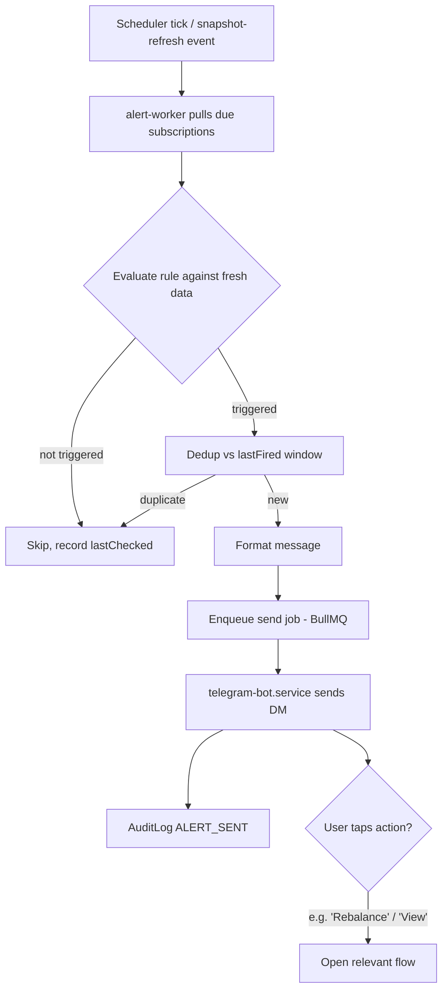

### 16.3 Delivery rules

- **Cadence caps** per type (e.g. price alerts max 1 per token per hour) to avoid spam.
- **Quiet hours** configurable per user.
- **Batching**: multiple simultaneous triggers coalesce into a single digest message.
- **Backoff** on Telegram `429` (respect `retry_after`).
- All alerts are opt-in; default off except TX (recommended on at link time, user-confirmable).

---

## 17. Error handling cases

| Case | Handling | User-facing message |
|---|---|---|
| Unlinked user messages bot | Resolve fails → onboarding reply | "You're not linked yet. Open Oracle Settings → Connect Telegram." |
| Expired/used link token | Reject in `link.service` | "This link expired. Generate a new one from Settings." |
| Invalid address / unresolvable ENS | Validation in `action.service` | "I couldn't resolve that recipient. Double-check the address/ENS." |
| Insufficient balance | Balance guard pre-approval | "You only have 0.04 ETH; can't send 0.1." |
| Stale snapshot | Refresh via `refreshWalletSnapshot` (respect cooldown) | silent refresh, else "Data may be a few minutes old." |
| Action expired before signing | TTL sweep → status=expired | "This request expired for safety. Start again." |
| Signing token reused/invalid | Reject at `/api/actions/:id/result` | "This signing link is no longer valid." |
| User rejects in wallet | `/result` with error | "Signing was cancelled in your wallet." |
| Tx reverts on-chain | Receipt watcher → failed | "❌ Transaction reverted. Funds were not moved (gas spent)." |
| DEX quote fails / slippage exceeded | swap.service error | "Couldn't get a good quote right now. Try again or adjust amount." |
| Moralis/CoinGecko outage | Cached snapshot + degraded notice | "Live data is temporarily unavailable; showing last known." |
| Anthropic timeout/error | Retry once, then fallback | "I'm having trouble thinking right now — try again in a moment." |
| Telegram API 429/5xx | Queue + backoff, respect retry_after | (transparent retry) |
| Webhook secret mismatch | 401, drop update, log | (none) |
| Duplicate `update_id` | Idempotent dedup via Redis | (none) |

Principle: **fail closed on anything touching value** — when uncertain, do not proceed to signing.

---

## 18. Rate limiting and abuse prevention

| Layer | Limit |
|---|---|
| Per Telegram user — messages | e.g. 20/min (sliding window, Redis) |
| Per user — AI calls | e.g. 30/hour (cost control) |
| Per user — pending actions | max 3 concurrent; max 10 write-initiations/hour |
| Per user — link token mints | 5 active; 10/hour |
| Global — Anthropic spend | circuit breaker / daily budget guard |
| Outbound — Telegram sends | respect Telegram's ~30 msg/sec global, per-chat 1/sec; queue |
| Unlinked chats | only `/start` + `/help`; everything else rejected |
| Value guards | per-tx + daily USD soft caps with extra confirmation above threshold |

Abuse mitigations: ignore non-DM contexts in v1 (no groups), drop messages from blocked/spam-flagged IDs, exponential backoff on repeated failed link attempts, and audit every rate-limit hit.

---

## 19. Logging, monitoring, and audit trail

### 19.1 Audit trail (`AuditLog`)

Every security-relevant event is recorded immutably: `LINK`, `UNLINK`, `ACTION_CREATE`, `ACTION_CONFIRM`, `SIGNING_TOKEN_ISSUED`, `TX_BROADCAST`, `TX_CONFIRMED`, `TX_FAILED`, `ALERT_SENT`, `RATE_LIMIT_HIT`, `AUTH_VERIFY`. Includes `userId`, actor, masked wallet, and metadata — **never** message content or secrets.

### 19.2 Operational logging

- Structured JSON logs (request id, telegram_id hash, latency, outcome).
- PII minimization: hash `telegram_id` in logs; mask addresses (`0xAB..CD`).
- Per-flow timing: webhook→reply, AI latency, snapshot fetch, signing round-trip.

### 19.3 Monitoring / alerting (ops)

| Metric | Why |
|---|---|
| Webhook error rate / latency | Bot health |
| AI call success + p95 latency + token cost | Reliability & spend |
| Action funnel: created → approved → broadcast → confirmed | Detect drop-off / signing breakage |
| Alert send success vs 429s | Notification health |
| Snapshot refresh failures (Moralis/CoinGecko) | Data quality |
| Rate-limit hit volume | Abuse signal |

Dashboards + paging on: webhook 5xx spike, AI budget breach, signing failure rate, Telegram send backlog.

---

## 20. Implementation phases

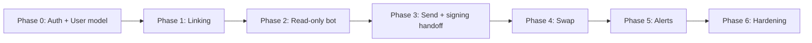

| Phase | Scope | Exit criteria |
|---|---|---|
| **0 — Foundation** | SIWE auth, `User`/`Wallet` models, migrations, backfill snapshots | Web app logs in with a real session; users/wallets persisted |
| **1 — Linking** | Bot skeleton, webhook, `link.service`, Settings UI, `/start` binding | A wallet can link/unlink Telegram end-to-end |
| **2 — Read-only bot** | Command router + AI handler; `/balance /portfolio /transactions /market /performance`, NL Q&A | Bot answers grounded questions matching web quality |
| **3 — Send** | `action.service`, approval cards, signing handoff, signer page reuse, receipt watcher | `/send` completes a real non-custodial transfer with confirmation |
| **4 — Swap** | `swap.service` (0x/1inch), approve+swap sequencing, swap tool in AI | `/swap` completes with quote, slippage, two-leg signing |
| **5 — Alerts** | `AlertSubscription`, worker, BullMQ, 4 alert types, `/alerts` + Settings toggles | Users receive deduped, capped alerts opt-in |
| **6 — Hardening** | Rate limits, audit log coverage, monitoring dashboards, abuse controls, load test | Meets security & ops bar; ready for GA |

---

## 21. Testing plan

### 21.1 Unit
- `tx-builder` (existing) — extend coverage for swap calldata.
- `link.service` token lifecycle (mint/expire/single-use/rebind rejection).
- `action.service` guards (balance, address, ENS, limits, expiry).
- Alert rule evaluation + dedup/cadence logic.
- Command parser (`/send 0.1 ETH to vitalik.eth` → structured action).

### 21.2 Integration
- Webhook → router → service with mocked Telegram API.
- AI handler with mocked Anthropic returning each tool type → correct `ActionRequest`.
- Signing flow: action → signing token → `/result` → status transitions (mock chain).
- SIWE auth verify happy/replayed-nonce paths.

### 21.3 End-to-end (testnet — Sepolia)
- Full link → `/balance` → `/send` (real signature via test wallet) → confirmation.
- Full `/swap` on a testnet DEX with approve+swap legs.
- Alert firing: simulate price move / inbound tx → DM received.

### 21.4 Security
- Link token replay/expiry/cross-user binding attempts.
- Webhook without/with-wrong secret rejected.
- Signing token reuse rejected; action TTL enforced.
- Rate-limit enforcement under burst.
- Confirm bot alone cannot move funds (no signature path bypasses wallet).

### 21.5 Load / resilience
- Burst of concurrent webhook updates; Redis session correctness.
- Telegram 429 backoff behavior.
- External outage (Moralis/CoinGecko/Anthropic) → graceful degradation messages.

### 21.6 UX / manual
- MarkdownV2 escaping, inline keyboard behavior, message edits on status change, quiet hours.

---

## 22. Future improvements

- **Direct WalletConnect-from-Telegram signing** — push session requests to the wallet app, removing the browser hop (Section 15.2).
- **Smart-account / session keys** — ERC-4337 session keys for pre-authorized, bounded actions (e.g. "swaps up to $50/day") enabling true in-chat execution within user-set limits, still non-custodial.
- **Multi-wallet & multi-chain UX** — quick `/wallet` switching, per-chain views, L2 coverage.
- **Group/community mode** — read-only market & portfolio widgets for groups (no signing).
- **Paper trading** — simulated portfolios and strategy testing surfaced in chat.
- **Proactive AI insights** — scheduled digests ("your week on-chain"), rebalancing suggestions, risk nudges.
- **Voice notes** — transcribe Telegram voice → AI query.
- **Limit orders / DCA** — schedule conditional actions that prompt the user to sign when triggered.
- **More integrations** — Discord/WhatsApp using the same transport-adapter pattern.
- **Localization** — multi-language bot responses.

---

## Appendix A — End-to-end onboarding sequence

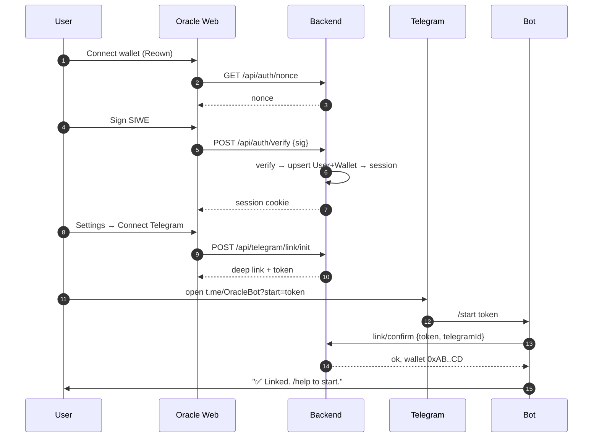

## Appendix B — Environment variables (new)

```
TELEGRAM_BOT_TOKEN=...
TELEGRAM_WEBHOOK_SECRET=...
TELEGRAM_BOT_USERNAME=OracleBot
DEX_AGGREGATOR_API_KEY=...        # 0x / 1inch
REDIS_URL=redis://...
SIGNER_BASE_URL=https://app.oracleprotocol.online/sign
SESSION_SECRET=...
```

## Appendix C — Reuse map (existing → bot)

| Existing | Reused for |
|---|---|
| `wallet.service.ts` / `wallet-snapshot.service.ts` | `/balance`, `/portfolio`, `/transactions`, AI grounding |
| `market.service.ts` | `/market`, NEWS/PRICE alerts |
| `ai.service.ts` + `prompts/tools.ts` | NL handler; extended with `swap_tokens` + read tools |
| `tx-builder.ts` | Building unsigned send/token tx for `ActionRequest` |
| `SendConfirmModal` (frontend) | Basis for the web signer page used in the handoff |
```
